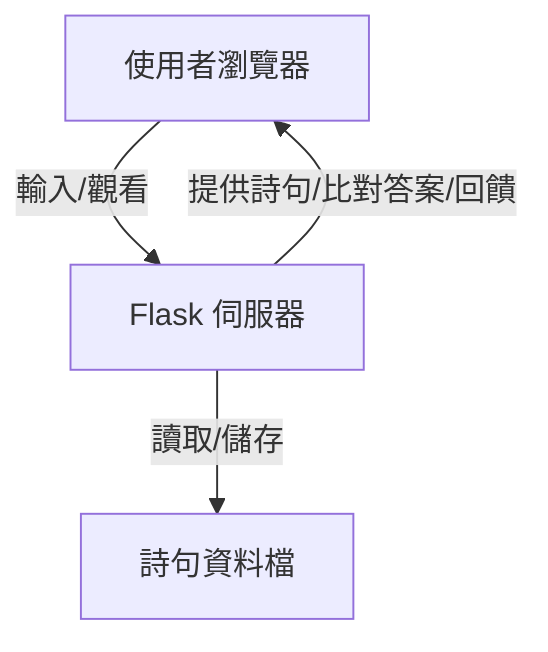
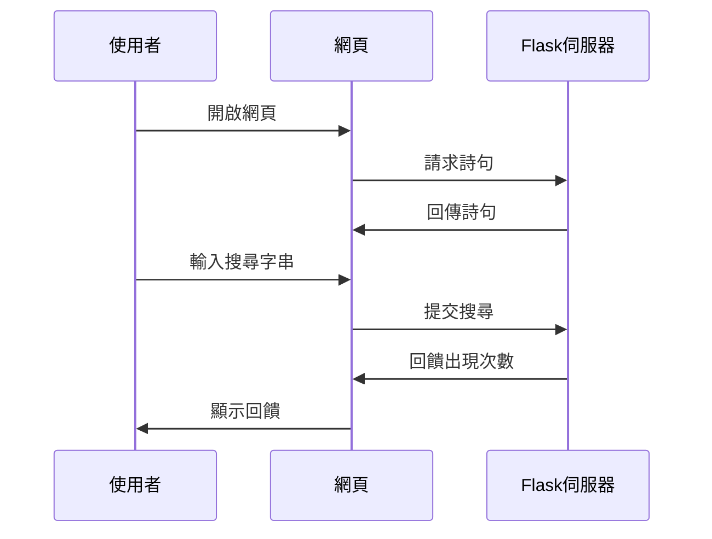

# 詩的字串練習 Flask 網頁專案設計筆記

## 一、任務由來

在程式學習的旅途中，字串處理是最溫柔也最詩意的起點。本專案靈感來自 Python x ChatGPT 的結合，選用徐志摩〈再別康橋〉詩句，讓學習者在詩意中練習字串處理（如 split、count、搜尋、長度等），體驗程式與詩的美感交融。讓每一行程式碼，都能像詩句一樣流動。

## 二、目標

- 讓使用者能夠：
  1. 讀取並顯示整首詩
  2. 切分詩句為串列（split）
  3. 計算行數與字數（len, sum, for 迴圈）
  4. 搜尋字串出現次數（count, in）
- 培養 Python 字串處理能力，並感受詩意程式設計的美。
- 讓初學者在詩的氛圍中，輕鬆掌握字串操作的核心技巧。

---

## 三、專案願景

用 Python + Flask + HTML/CSS，打造一個詩意盎然的字串練習網頁，讓學習程式也能像寫詩一樣優雅。

---

## 四、什麼是 Flask？

Flask 是一個輕量級的 Python 網頁框架。它讓你用簡單的 Python 程式碼，就能建立一個網頁應用程式。你可以把它想像成「用 Python 寫網頁」的魔法工具。

---

## 五、系統架構圖



---

## 六、功能分解（字串處理教學重點）

1. **首頁**：展示詩句，讓使用者練習字串操作。
2. **字串切分**：將詩句以 `split('\n')` 切分為串列，逐行顯示。  
   *教學重點：split 的用法，如何將長字串變成串列。*
3. **行數與字數統計**：計算詩的行數與總字數（含標點）。  
   *教學重點：len()、for 迴圈、sum() 等統計技巧。*
4. **字串搜尋**：讓使用者輸入字串，顯示該字串在詩中出現的次數。  
   *教學重點：count()、in 運算子，如何搜尋與比對字串。*
5. **美感設計**：用 HTML/CSS 打造詩意的網頁。

---

## 七、檔案結構建議

```
poem_string_practice/
│
├── app.py              # Flask 主程式
├── poems.txt           # 詩句資料檔
├── templates/
│   └── index.html      # 首頁 HTML
└── static/
    └── style.css       # 美感 CSS
```

---

## 八、開發步驟（字串處理實作）

### 1. 準備詩句資料
- 用一個簡單的 `poems.txt`，每行一個詩句，或直接在程式中以多行字串儲存。
- *重點：體會多行字串與串列的轉換。*

### 2. 建立 Flask 主程式（app.py）
- 載入詩句
- 顯示詩句
- 使用 `split('\n')` 切分詩句
- 計算行數與字數（`len()`、`sum()`）
- 接收使用者輸入的搜尋字串，使用 `count()` 統計出現次數
- 顯示所有結果
- *重點：每一步都練習對字串的操作與理解。*

### 3. 設計 HTML 介面（templates/index.html）
- 顯示完整詩句
- 顯示切分後的串列
- 顯示行數、字數
- 提供搜尋字串的輸入框
- 顯示搜尋結果
- *重點：將 Python 處理的結果優雅呈現於網頁。*

### 4. 美化網頁（static/style.css）
- 字體、顏色、排版，營造詩意氛圍

---

## 九、流程圖



---

## 十、美感設計建議

- **字體**：可用 Google Fonts 的「Noto Serif TC」或「思源宋體」。
- **色彩**：米白、淡青、墨綠，營造靜謐詩意。
- **排版**：詩句置中，留白充足，按鈕圓潤。
- **互動**：回饋語句也詩意，如「字字珠璣」、「詩心可嘉」。

---

## 十一、學習路徑建議

1. 先學會 Flask 的基本用法（啟動伺服器、渲染 HTML）。
2. 學會 HTML 表單與 CSS 美化。
3. 練習 Python 字串 split、count、搜尋等操作。
4. 一步步組合成完整作品。

---

> 讓程式如詩，讓學習如畫。  
> 你可以依這份筆記，優雅地展開你的詩意程式之旅。

---

如需範例程式碼或每一步的詳細教學，請隨時告訴我。
