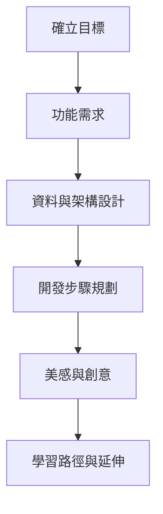
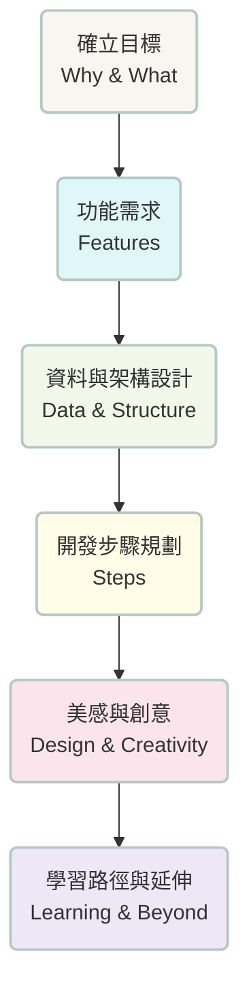

# 詩的字串練習：專案規劃美感筆記

## 1. 明確「學習目標」與「任務由來」
- 為什麼要做這個練習？  
  結合詩意與程式，讓字串處理變得有趣。
- 希望學會哪些 Python 技能？  
  split、count、搜尋、len 等字串操作。

---

## 2. 構思「功能需求」與「使用者體驗」
- 需要哪些基本功能？  
  顯示詩句、切分、計算、搜尋。
- 如何讓操作過程詩意又直覺？  
  美感設計、互動回饋。

---

## 3. 設計「資料結構」與「程式架構」
- 詩句資料要怎麼儲存？  
  txt 檔、多行字串、串列。
- 程式要怎麼分工？  
  主程式、前端介面、資料處理。

---

## 4. 規劃「開發步驟」與「學習重點」
- 先做什麼、後做什麼？  
  先準備詩句，再做 split、再做搜尋。
- 每一步要練習哪些 Python 技巧？  
  for 迴圈、函式、字串方法。

---

## 5. 美感與創意的融入
- 字體、色彩、排版如何呼應詩的氛圍？
- 互動回饋如何設計得詩意又鼓勵人心？

---

## 6. 預想「學習路徑」與「延伸挑戰」
- 初學者可以怎麼循序漸進？
- 有哪些進階玩法？  
  自訂詩句、進階搜尋、資料視覺化。

---

### 【規劃流程圖示意】

---

## 【規劃流程圖示意：圖形化專案規劃】

以下以圖形化方式，呈現詩的字串練習專案的規劃脈絡：

---

這份筆記不僅是技術地圖，更是詩意的起點。  
讓每一行程式碼，都能像詩句一樣流動。
