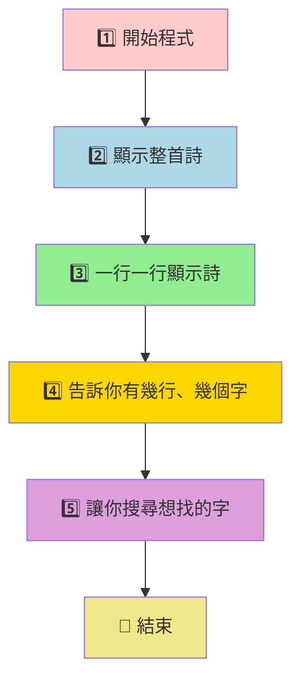
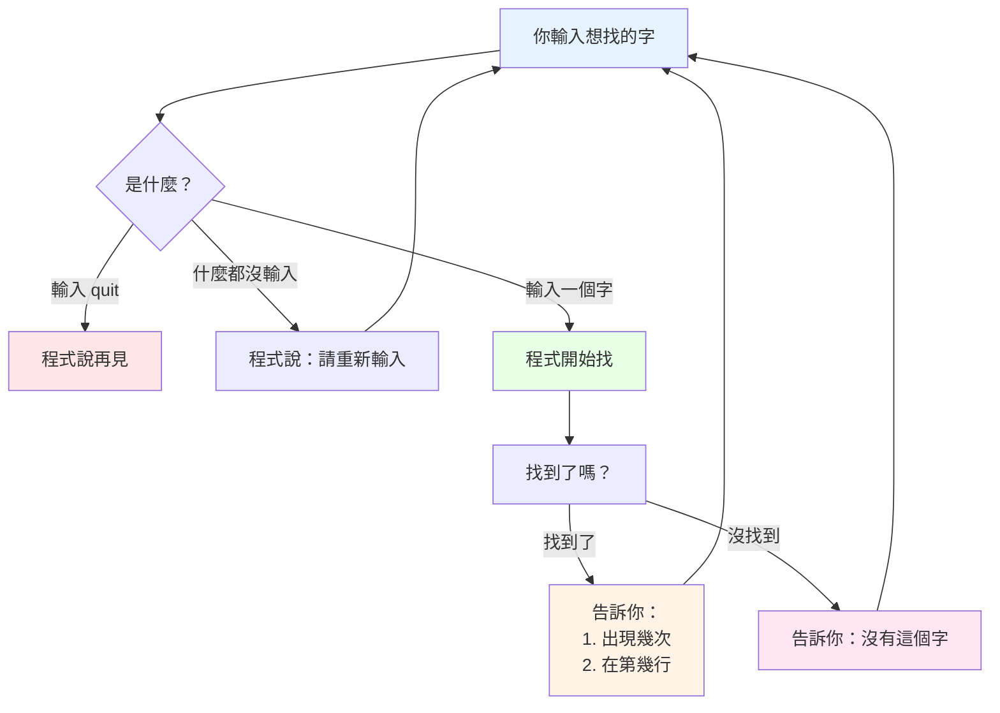
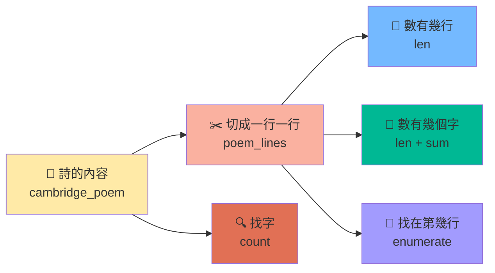

# 詩韻程式 - 超簡單架構圖

## 🌟 程式做什麼？（一句話說明）
**這個程式就像一個聰明的詩歌助手，幫你分析詩、數字數、找字詞！**

---

## 📝 程式的5個步驟（超簡單版）



---

## 🔍 搜尋功能怎麼運作？（超簡單版）



---

## 📊 程式用到的東西（像工具箱）



---

## 🎯 程式像什麼？（比喻說明）

### 就像一個圖書館管理員：
1. **📚 拿出一本詩集**（載入詩的內容）
2. **📄 把詩一頁一頁翻開**（分行顯示）
3. **🔢 數一數有幾頁、幾個字**（統計功能）
4. **🔍 幫你找特定的字在哪裡**（搜尋功能）
5. **👋 工作完成，說再見**（結束程式）

---

## 💡 重要的程式概念（用最簡單的話說）

### 🏠 變數（像房子放東西）
- `cambridge_poem` = 整首詩的家
- `poem_lines` = 每一行詩的家

### 🔧 功能（像工具）
- `split()` = 剪刀，把詩剪成一行一行
- `len()` = 計數器，數有多少
- `count()` = 放大鏡，找字出現幾次
- `enumerate()` = 標籤機，給每行貼上號碼

### 🔄 循環（像跑步機）
- `while True:` = 一直跑一直跑，直到你說停

---

## 🌈 程式的心情（每個步驟的感覺）

```
開始 😊 → 顯示詩 📖 → 分行顯示 📝 → 統計數字 🔢 → 搜尋字詞 🔍 → 結束 👋
```

---

*「程式就像一個溫柔的朋友，一步一步陪你探索詩的美麗世界」*
