# 詩韻程式架構圖

## 🎨 整體系統架構圖

```mermaid
graph TD
    A[🌸 程式啟動] --> B[📚 載入詩作內容]
    B --> C[✂️ 詩句分割處理]
    C --> D[🖼️ 完整詩作展示]
    D --> E[📝 逐行編號展示]
    E --> F[📊 統計資訊計算]
    F --> G[🔍 互動搜尋系統]
    G --> H{用戶輸入判斷}
    H -->|quit| I[👋 優雅結束]
    H -->|空白| J[⚠️ 重新輸入提示]
    H -->|有效字串| K[🔎 執行搜尋功能]
    J --> G
    K --> L[📈 顯示搜尋結果]
    L --> G
    
    style A fill:#ffb3ba
    style I fill:#bae1ff
    style G fill:#ffffba
    style K fill:#baffc9
```

## 🏗️ 資料結構架構圖

```mermaid
graph LR
    A[cambridge_poem<br/>完整詩作字串] --> B[split方法]
    B --> C[poem_lines<br/>詩句列表]
    C --> D[enumerate處理]
    D --> E[行號 + 詩句內容]
    
    A --> F[len計算]
    F --> G[總字數統計]
    
    C --> H[逐行len計算]
    H --> I[sum加總]
    I --> J[總字數統計]
    
    style A fill:#e1f5fe
    style C fill:#f3e5f5
    style E fill:#e8f5e8
    style G fill:#fff3e0
    style J fill:#fff3e0
```

## 🔍 搜尋功能流程圖

```mermaid
flowchart TD
    A[🔍 搜尋功能啟動] --> B[while True 循環]
    B --> C[📝 用戶輸入字串]
    C --> D{輸入內容判斷}
    
    D -->|quit| E[🚪 跳出循環]
    D -->|空白字串| F[⚠️ 提示重新輸入]
    D -->|有效字串| G[🔎 開始搜尋處理]
    
    F --> B
    
    G --> H[📊 使用count計算次數]
    H --> I{是否找到}
    
    I -->|找到| J[✅ 顯示出現次數]
    I -->|未找到| K[❌ 顯示未找到訊息]
    
    J --> L[🎯 enumerate尋找位置]
    L --> M[📍 顯示出現行號與內容]
    
    M --> B
    K --> B
    E --> N[🌟 程式結束]
    
    style A fill:#e3f2fd
    style E fill:#ffebee
    style G fill:#e8f5e8
    style J fill:#e1f5fe
    style K fill:#fce4ec
```

## 📊 核心功能模組圖

```mermaid
mindmap
  root((詩韻程式))
    資料處理模組
      詩作載入
      字串分割
      資料結構建立
    展示模組
      完整詩作顯示
      逐行編號顯示
      美化輸出格式
    統計模組
      行數計算
      字數統計
      數據彙總
    搜尋模組
      字串搜尋
      次數統計
      位置定位
    互動模組
      用戶輸入處理
      循環控制
      錯誤處理
    美學模組
      介面美化
      訊息格式化
      優雅結束
```

## 🎯 程式執行時序圖

```mermaid
sequenceDiagram
    participant U as 👤 用戶
    participant P as 🖥️ 程式
    participant D as 📚 資料處理
    participant S as 🔍 搜尋引擎
    
    U->>P: 啟動程式
    P->>D: 載入詩作內容
    D->>P: 返回處理後資料
    P->>U: 顯示完整詩作
    P->>U: 顯示逐行內容
    P->>U: 顯示統計資訊
    
    loop 搜尋循環
        P->>U: 提示輸入搜尋字串
        U->>P: 輸入字串
        alt 輸入quit
            P->>U: 顯示結束訊息
        else 輸入空白
            P->>U: 提示重新輸入
        else 有效字串
            P->>S: 執行搜尋
            S->>P: 返回搜尋結果
            P->>U: 顯示搜尋結果
        end
    end
```

## 🌈 技術架構層次圖

```mermaid
graph TB
    subgraph "🎨 展示層 (Presentation Layer)"
        A1[用戶介面]
        A2[格式化輸出]
        A3[美學設計]
    end
    
    subgraph "🧠 邏輯層 (Logic Layer)"
        B1[搜尋邏輯]
        B2[統計邏輯]
        B3[流程控制]
    end
    
    subgraph "📊 資料層 (Data Layer)"
        C1[詩作內容]
        C2[分行資料]
        C3[統計資料]
    end
    
    subgraph "🔧 工具層 (Utility Layer)"
        D1[字串處理]
        D2[列表操作]
        D3[數值計算]
    end
    
    A1 --> B1
    A2 --> B2
    A3 --> B3
    B1 --> C1
    B2 --> C2
    B3 --> C3
    C1 --> D1
    C2 --> D2
    C3 --> D3
    
    style A1 fill:#ffcdd2
    style B1 fill:#c8e6c9
    style C1 fill:#bbdefb
    style D1 fill:#fff9c4
```

---

*「架構如詩韻，層次分明；流程如樂章，和諧優美」*
